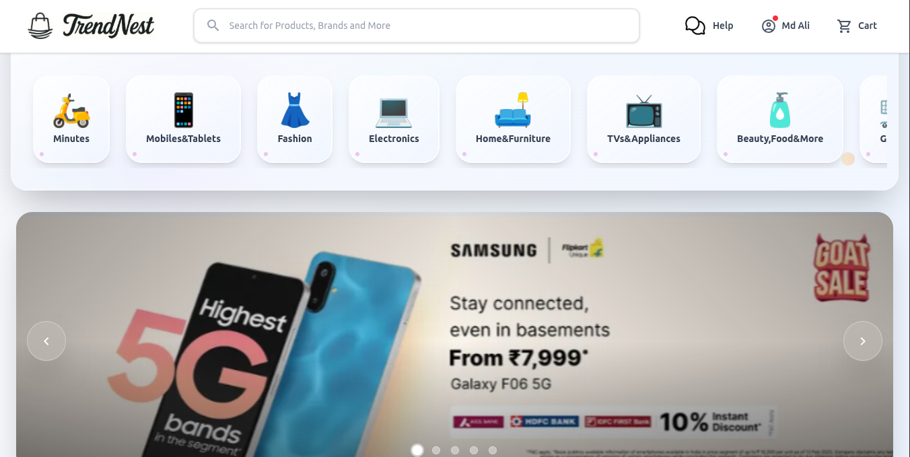
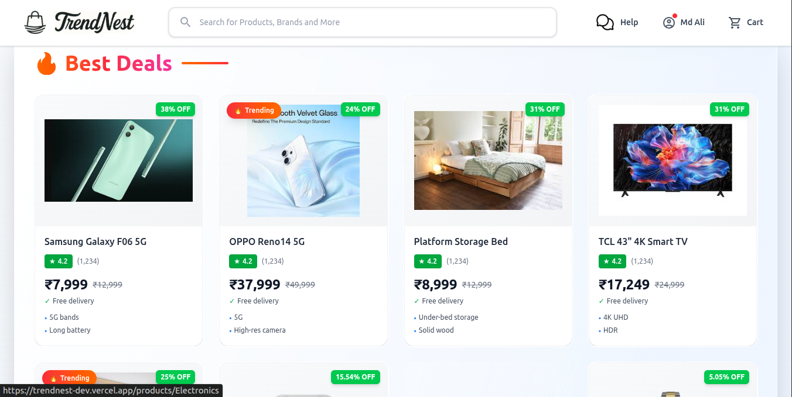
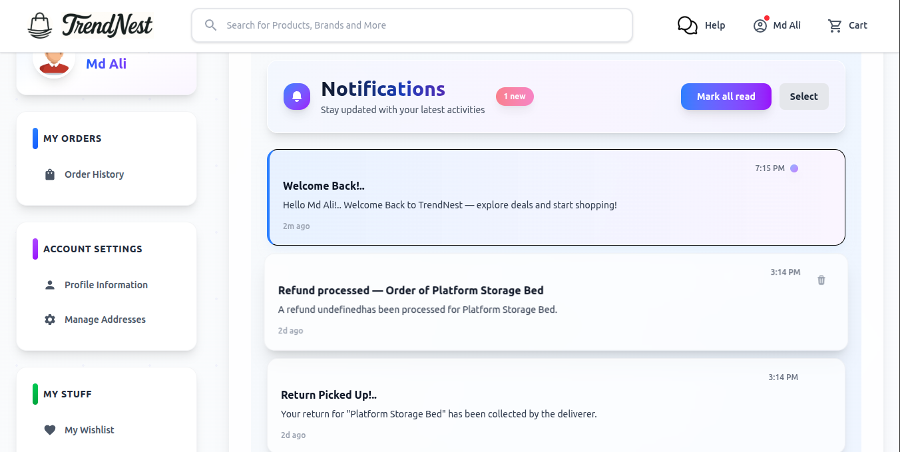
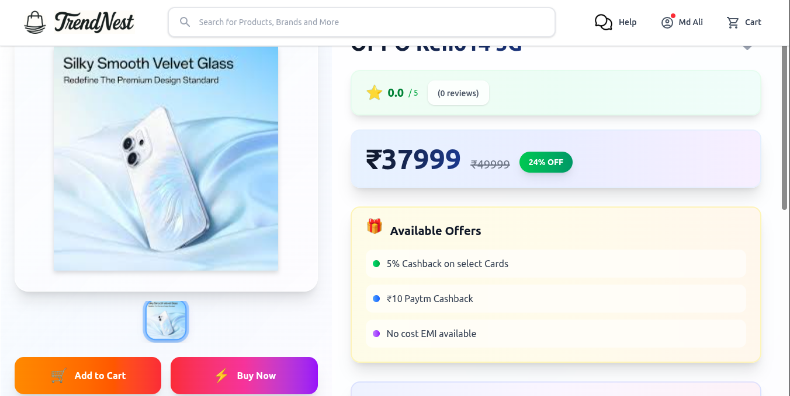
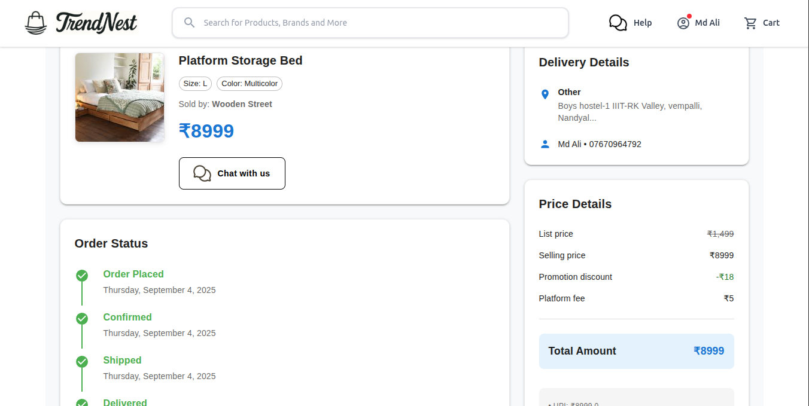
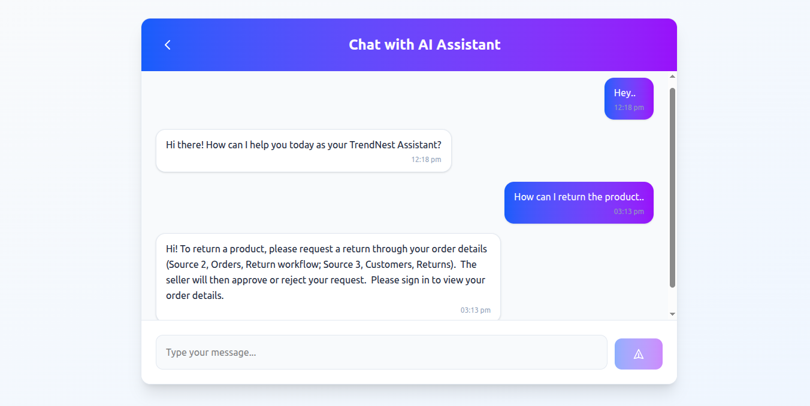
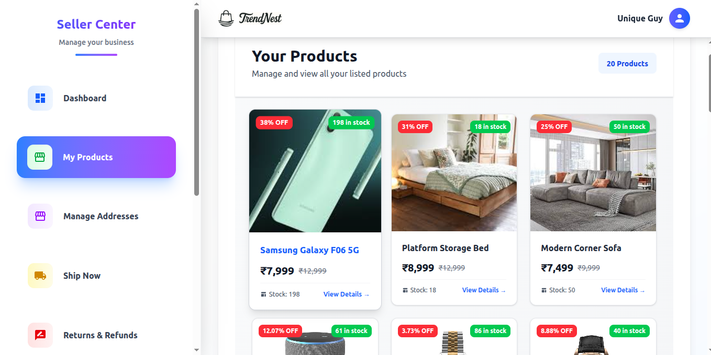
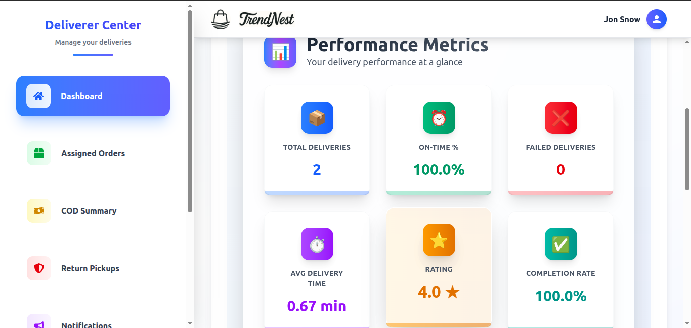

# TrendNest
Full-Stack Multi-Role E-Commerce Platform using MERN, Socket.IO, and Google Cloud Storage

[Visit Now](https://trendnest-dev.vercel.app) 🚀

## 🖥️ Tech Stack
**Frontend:**

&nbsp;
&nbsp;
&nbsp;
&nbsp;
&nbsp;

**Backend:**

&nbsp;
&nbsp;
&nbsp;
&nbsp;

**Realtime Communication:**

**Cloud Storage:**

---

## 🚀 Features
**Authentication and Role Management**
- 🔐 Secure login/signup with JWT stored in HTTP-only cookies
- 👥 Role-based users: Customer, Seller, Deliverer, Admin
- ⚙️ Profile management for each role

**Customer Features**
- 🛒 Cart and Wishlist functionality
- 📦 Place and track orders with multiple addresses
- ⭐ Add product reviews and ratings

**Seller Dashboard**
- 📤 Add/Edit/Delete products with image uploads via Google Cloud Storage
- 📊 Product analytics, weekly stats, and ratings using Recharts
- 📝 Manage shop profile, bank details, and customer reviews
- 📤 Ship Orders, Return Acceptance & Refund Money

**Deliverer Dashboard**
- 🚚 Manage assigned orders and update delivery status
- 📈 View delivery metrics and performance tracking
- 📝 Manage Deliverer profile, Vehicle details, and delivery ratings
- 📤 Delivering Orders & PickingUp Returns

**Realtime & Notifications**
- 📢 Push notifications for order updates
- 💬 Socket.IO-based real-time chat and live updates

---

## Sneak Peek of TrendNest 🙈 :

### 👤 Customer Profile

### 🛍️ Seller Dashboard

### 🚚 Deliverer Dashboard

---

## 📬 Contact

Feel free to reach me through the below handles if you'd like to connect:

  
  

